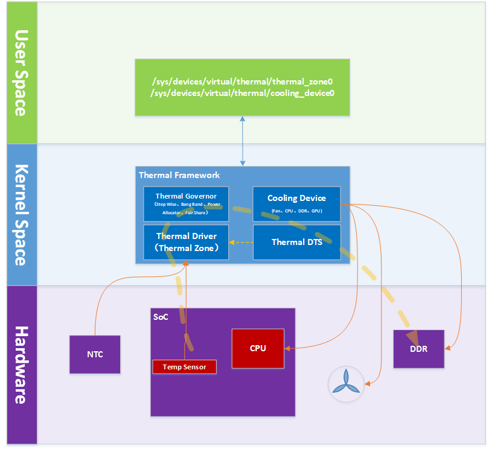

# Thermal Framework

## Thermal Framework Overview



https://www.cnblogs.com/arnoldlu/p/11207142.html


## Throttling and Tripping


## Governor

- gov_bang_bang
- gov_power_allocator
- gov_user_space
- gov_fair_share
- gov_step_wise

Linaro Presentation: https://static.linaro.org/connect/san19/presentations/san19-101.pdf


Power Allocator Governor

PID 제어 알고리즘을 활용하여, 원하는 온도가 될 때까지 정해진 power budget (배터리 용량) 내에서 power allocation 을 조정하는 것이다.

>  P_max = k_p * e + k_i * err_integral + k_d * diff_err + sustainable_power

목표치가 100일 때, 현재 온도가 110도라면 overshoot 상태이고, P를 -10\*k_po 로 계산하고, 현재 온도가 30도라면 undershoot로 70\*k_pu 로 계산한다. (최종 결과는 PID 값 다 넣고 sustainable power 까지 합산한 결과)

```text
                                    k_d
                                     |
current_temp                         |
     |                               v
     |              +----------+   +---+
     |       +----->| diff_err |-->| X |------+
     |       |      +----------+   +---+      |
     |       |                                |      tdp        actor
     |       |                      k_i       |       |  get_requested_power()
     |       |                       |        |       |        |     |
     |       |                       |        |       |        |     | ...
     v       |                       v        v       v        v     v
   +---+     |      +-------+      +---+    +---+   +---+   +----------+
   | S |-----+----->| sum e |----->| X |--->| S |-->| S |-->|power     |
   +---+     |      +-------+      +---+    +---+   +---+   |allocation|
     ^       |                                ^             +----------+
     |       |                                |                |     |
     |       |        +---+                   |                |     |
     |       +------->| X |-------------------+                v     v
     |                +---+                               granted performance
desired_temperature     ^
                        |
                        |
                    k_po/k_pu
```

https://www.kernel.org/doc/html/v5.7/driver-api/thermal/power_allocator.html

v5.9.11 linux

drivers/thermal/gov_power_allocator.c

```c
static int power_allocator_throttle(struct thermal_zone_device *tz, int trip)
{
        int ret;
        int switch_on_temp, control_temp;
        struct power_allocator_params *params = tz->governor_data;

        /*
         * We get called for every trip point but we only need to do
         * our calculations once
         */
        if (trip != params->trip_max_desired_temperature)
                return 0;

        ret = tz->ops->get_trip_temp(tz, params->trip_switch_on,
                                     &switch_on_temp);
        if (!ret && (tz->temperature < switch_on_temp)) {
                tz->passive = 0;
                reset_pid_controller(params);
                allow_maximum_power(tz);
                return 0;
        }

        tz->passive = 1;

        ret = tz->ops->get_trip_temp(tz, params->trip_max_desired_temperature,
                                &control_temp);
        if (ret) {
                dev_warn(&tz->device,
                         "Failed to get the maximum desired temperature: %d\n",
                         ret);
                return ret;
        }

        return allocate_power(tz, control_temp);
}
```

switch_on_temp 는 해당 governor 가 동작하기 시작하는 기준 온도이다. (항상 동작하면 PID 계산식에 error 값이 계속 누적되기 때문에 굉장히 느리게 원하는 온도에 도달하게 된다.) 혹은 governor가 동작 중에 해당 기준 온도보다 낮아지면 동작을 멈추는 것뿐만 아니라 그동안 계산하던 PID 식도 reset 한다.

```c
        ret = tz->ops->get_trip_temp(tz, params->trip_switch_on,
                                     &switch_on_temp);
        if (!ret && (tz->temperature < switch_on_temp)) {
                tz->passive = 0;
                reset_pid_controller(params);
                allow_maximum_power(tz);
                return 0;
        }
```

기준 온도를 넘어서면 유지하고 싶은 온도 (desired temperature) 을 맞출 수 있도록 power 를 할당한다.

```c
        ret = tz->ops->get_trip_temp(tz, params->trip_max_desired_temperature,
                                &control_temp);
        if (ret) {
                dev_warn(&tz->device,
                         "Failed to get the maximum desired temperature: %d\n",
                         ret);
                return ret;
        }

        return allocate_power(tz, control_temp);
```

allocate_power 함수에서는 할당 가능한 power 를 계산한다.

```c
                if (cdev->ops->get_requested_power(cdev, tz, &req_power[i]))
                        continue;

                if (!total_weight)
                        weight = 1 << FRAC_BITS;
                else
                        weight = instance->weight;

                weighted_req_power[i] = frac_to_int(weight * req_power[i]);

                if (power_actor_get_max_power(cdev, tz, &max_power[i]))
                        continue;

                total_req_power += req_power[i];
                max_allocatable_power += max_power[i];
                total_weighted_req_power += weighted_req_power[i];

                i++;
```

그리고 이 계산된 power 값을 적용한다.

```c
        list_for_each_entry(instance, &tz->thermal_instances, tz_node) {
                if (instance->trip != trip_max_desired_temperature)
                        continue;

                if (!cdev_is_power_actor(instance->cdev))
                        continue;

                power_actor_set_power(instance->cdev, instance,
                                      granted_power[i]);
                total_granted_power += granted_power[i];

                i++;
        }
```

drivers/thermal/cpufreq_cooling.c

```c
        for_each_cpu(cpu, policy->related_cpus) {
                u32 load;

                if (cpu_online(cpu))
                        load = get_load(cpufreq_cdev, cpu, i);
                else
                        load = 0;

                total_load += load;
                if (load_cpu)
                        load_cpu[i] = load;

                i++;
        }

        cpufreq_cdev->last_load = total_load;

        *power = get_dynamic_power(cpufreq_cdev, freq);
```

```c
static u32 get_dynamic_power(struct cpufreq_cooling_device *cpufreq_cdev,
                             unsigned long freq)
{
        u32 raw_cpu_power;

        raw_cpu_power = cpu_freq_to_power(cpufreq_cdev, freq);
        return (raw_cpu_power * cpufreq_cdev->last_load) / 100;
}
```

power 를 계산할 때는 cpu load 를 고려하여 계산한다.

drivers/thermal/thermal_core.c

```c
int power_actor_set_power(struct thermal_cooling_device *cdev,
                          struct thermal_instance *instance, u32 power)
{
        unsigned long state;
        int ret;

        if (!cdev_is_power_actor(cdev))
                return -EINVAL;

        ret = cdev->ops->power2state(cdev, instance->tz, power, &state);
        if (ret)
                return ret;

        instance->target = state;
        mutex_lock(&cdev->lock);
        cdev->updated = false;
        mutex_unlock(&cdev->lock);
        thermal_cdev_update(cdev);

        return 0;
}
```

그리고 power2state 함수를 호출하여 power 를 설정한다.

drivers/thermal/cpufreq_cooling.c

```c
// cpufreq_power2state
static int cpufreq_power2state(struct thermal_cooling_device *cdev,
                               struct thermal_zone_device *tz, u32 power,
                               unsigned long *state)
{
        unsigned int target_freq;
        u32 last_load, normalised_power;
        struct cpufreq_cooling_device *cpufreq_cdev = cdev->devdata;
        struct cpufreq_policy *policy = cpufreq_cdev->policy;

        last_load = cpufreq_cdev->last_load ?: 1;
        normalised_power = (power * 100) / last_load;
        target_freq = cpu_power_to_freq(cpufreq_cdev, normalised_power);

        *state = get_level(cpufreq_cdev, target_freq);
        trace_thermal_power_cpu_limit(policy->related_cpus, target_freq, *state,
                                      power);
        return 0;
}

// cpu_power_to_freq
static u32 cpu_power_to_freq(struct cpufreq_cooling_device *cpufreq_cdev,
                             u32 power)
{
        int i;

        for (i = cpufreq_cdev->max_level; i >= 0; i--) {
                if (power >= cpufreq_cdev->em->table[i].power)
                        break;
        }

        return cpufreq_cdev->em->table[i].frequency;
}
```


sustainable_power 는 device tree 에 다음과 같이 sustainable-power 노드로 선언한다.

arch/arm64/boot/dts/mediatek/mt8173.dtsi

```c
        thermal-zones {
                cpu_thermal: cpu_thermal {
                        polling-delay-passive = <1000>; /* milliseconds */
                        polling-delay = <1000>; /* milliseconds */

                        thermal-sensors = <&thermal>;
                        sustainable-power = <1500>; /* milliwatts */

                        trips {
                                threshold: trip-point0 {
                                        temperature = <68000>;
                                        hysteresis = <2000>;
                                        type = "passive";
                                };

                                target: trip-point1 {
                                        temperature = <85000>;
                                        hysteresis = <2000>;
                                        type = "passive";
                                };

                                cpu_crit: cpu_crit0 {
                                        temperature = <115000>;
                                        hysteresis = <2000>;
                                        type = "critical";
                                };
                        };

```

smooth 하게 조정할 수 있고, 원하는 온도로 도달할 수 있다는 장점이 있다.


## sysfs

현재 온도 확인

```shell
$ cat /sys/class/thermal/thermal_zone0/temp
```


Reference

[Linux kernel documentation - Thermal](https://www.kernel.org/doc/html/latest/driver-api/thermal/index.html)

[Thermal Framework](https://dongka.github.io/2018/06/25/thermal/thermal_framework/)

https://www.linaro.org/blog/thermal-notifications-with-netlink/

https://www.cnblogs.com/hellokitty2/p/15600099.html

https://blog.csdn.net/weixin_40237571/article/details/111953849

https://www.kernel.org/doc/html/v5.7/driver-api/thermal/cpu-idle-cooling.html

[DTPM - Dynamic Thermal Power Management](https://www.kernel.org/doc/html/latest/power/powercap/dtpm.html)