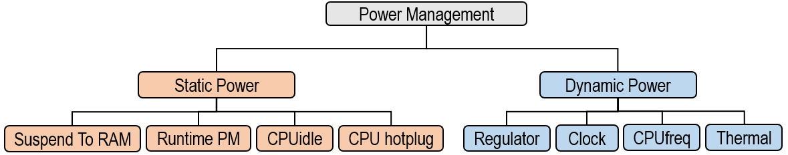

# Welcome to Linux Power Management Guide Document

## Power Management 가 중요한 이유?

많은 제품들이 유선 전원 공급 장치가 아닌 배터리로 전원이 공급됩니다. 따라서 배터리에 저장된 에너지를 효율적으로 사용하는 것이 중요합니다. (배터리 에너지를 효율적으로 사용할수록 배터리 충전당 제품의 사용 가능 시간이 증가합니다)

전체 전력 소모 양은 크게 **동적인 전력 (Dynamic Power, Switching Power)**과 **정적인 전력 (Static Power, Leakage Power)** 을 합한 값으로 볼 수 있습니다. 정적인 전력은 아무 활동이 없는 상태일 때도 계속해서 일정하게 소모되는 전력을 의미합니다. 반면, 동적인 전력은 활동이 있음으로써 생겨나는 전력 소모입니다.[^1]

아래 그래프를 보면 언제나 소모되고 있는 최소한의 양이 보입니다. 이것이 Leakage Power 입니다. 그 위에 Dyanmic Power 가 추가됩니다.

 

따라서 에너지를 효율적으로 사용하기 위한 방법 (Power savings) 도 두 가지로 나눠볼 수 있습니다.[^2] 첫번째는 **정적 전원 관리 (Static Power Management)** 로 제품이 비활성화 (inactive) 상태일 때나 사용자가 스위치 입력 등으로 선택한 경우 저전력 시스템 상태 (Low-power system states) 로 전환하는 것입니다. 혹은 사용하지 않고 있는 부분의 전원만 차단할 수도 있습니다.

두번째는 **동적 전원 관리 (Dynamic Power Management)** 로 제품이 사용 중일 때 전원을 관리하는 것입니다. 이러한 전원 관리에는 CPU 주파수 & 전압 조정이나 주변 장치의 클럭 및 전원 제어 등이 포함됩니다.

## Static Power Management

정적 전원 관리는 일부 또는 모든 시스템 구성 요소의 전원을 꺼서 저전력 시스템 상태로 진입시킵니다. Linux 에서는 다음과 같은 저전력 시스템 상태 (Low-power system states) 혹은 시스템 절전 상태 (System Sleep States) 를 지원합니다. [^3]

- Suspend-to-Idle
- Stanby
- Suspend-to-RAM
- Hibernation

또는 Linux 에서 지원하는 Runtime Power Management Framework 를 사용하면 전원을 제어하고 싶은 일부 영역이나 디바이스의 전원을 완전히 끄거나 켤 수 있습니다. 이런 일부가 아니라 전체 시스템의 전원을 관리하려면 위에서 소개한 Suspend To RAM 등의 기능을 이용해야합니다.

## Dynamic Power Management

정적으로 전력 관리를 위해서는 전압이나 클락 주파수를 낮추는 방법을 사용할 수 있습니다. 혹은 온도 센서를 통해 현재 CPU 의 온도를 확인하여 시스템을 보호하기 위해 전압이나 클락 주파수를 낮춥니다. 전압이나 클락 주파수를 낮춰서 전력 소비를 줄이게 되면 온도가 감소합니다.

* CPU frequency Scaling (Dynamic Voltage and Frequency Scaling; DVFS)
* Dynamic Thermal Management

아래는 전체 보드 위의 CPU 의 위치 및 CPU 근처의 온도 센서가 위치한 예시입니다.

## Linux Power Framework

Linux 에서 제공하는 전력 관리를 위한 Framework 는 다음과 같습니다.

![[Diagram]](https://static.lwn.net/images/2011/elc-kucheria-diagram.png)

이를 Static Power 와 Dynamic Power 로 분리해서 보면 아래와 같습니다.

정적 전원 관리에 해당하는 Linux Framework 및 Driver를 보면 다음과 같습니다.

- Suspend To RAM

시스템이 켜져있을 때 일정하게 소비되는 전력을 줄이기 위해서는 전체 시스템을 절전 상태 (Suspend To RAM) 로 변경할 수 있습니다.

- Runtime PM

전체 시스템이 아닌 일부 디바이스 등의 전원을 켜거나 끄도록 관리할 수 있습니다.

- CPUidle

CPU 가 할 일이 없을 때는 에너지 절약을 위하여 CPU 를 저전력 모드로 변경할 수 있습니다. 여러 모드들이 있는데, C-State 라고 하며, C0 (정상 작동 모드) 부터 C1, C2, C3 등이 있습니다. [^4] 

- CPU hotplug

CPU hotplug 란 사용하지 않는 CPU 의 전원을 아예 꺼버리는 방법입니다.  예를 들어, Suspend To RAM 처럼 전체 시스템이 절전모드로 가는 경우, CPU 가 hotplug out 되어 꺼집니다. 

CPU가 hotplug out 되는 경우에는 CPU 가 다시 켜지기 (hotplug in) 전까지는 아예 스케줄링에서도 제외됩니다. 위의 CPUidle 은 스케줄링이 필요할 때 CPU가 저전력 모드에 있다가 다시 C0 상태로 돌아올 수 있다는 차이점이 있습니다.

동적 전원 관리에 해당하는 Linux Framework 및 Driver를 보면 다음과 같습니다.

- Regulator

전압 (voltage) 을 공급하는 PMIC 를 제어하기 위한 framework 입니다. 전압을 변경하거나 켜고 끄는 등의 동작을 할 수 있습니다. CPUfreq 등 다른 driver 와 함께 쓰이게 됩니다.

- Clock

Clock 을 낮추거나 Clock 공급을 중단할 때 사용할 수 있는 framework 입니다.

- CPUfreq

동적 전압 스케일링 (Dynamic Voltage and Frequency Scaling; DVFS) 를 위한 framework 입니다. governor 가 정기적으로 모니터링을 하면서 cpu load 에 따라 일이 별로 없을 때는 전력 소비를 절약하기 위해 CPU 를 낮은 클락 주파수 & 전압으로 동작하게 하고, 일이 많을 때는 성능을 위해 높은 클락 주파수 & 전압으로 동작하게 할 수 있습니다. governor 의 종류에 따라 다른 방식으로 동작할 수도 있습니다.

- Thermal

Linux 의 Thermal Framework 를 사용하면 온도가 너무 높은 경우 Cooling을 하거나 CPU 클락 주파수를 낮춰서 온도를 낮출 수 있습니다. (Power 가 증가하면 온도도 상승하며, Power가 감소하면 온도가 낮아집니다.)

## 참고 자료

[^1]: Low Power Design: https://www.synopsys.com/glossary/what-is-low-power-design.html
[^2]: Power Management Specification: https://elinux.org/Dynamic_Power_Management_Specification
[^3 ]: Linux System Sleep States: https://www.kernel.org/doc/html/latest/admin-guide/pm/sleep-states.html
[^4]: C-state: https://www.dell.com/support/kbdoc/ko-kr/000060621/c-state%EB%8A%94-%EB%AC%B4%EC%97%87%EC%9D%B8%EA%B0%80